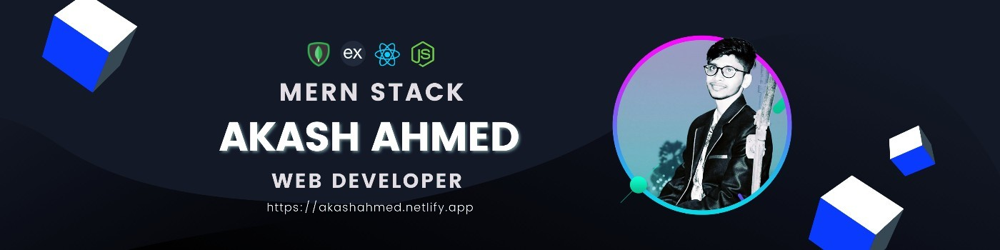

<!-- // -->

## Hi, I'm Akash Ahmed 

  👑 I am Web Developer  
  🖊️ Love to write code  
  🎤 Like to share my knowledge  
  🥅 Goals: Need to know!

 

I am a junior web developer, with experience in web applications and building websites. I am undergraduate honours in G&E. In my free time, I study new technologies. I am both driven and self-motivated.

## 👨‍💻 Languages and Tools:

## 
 

## ☕ Connect with me! 

 

## 📧 For Business Inquiries:

