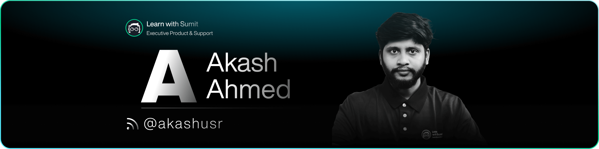
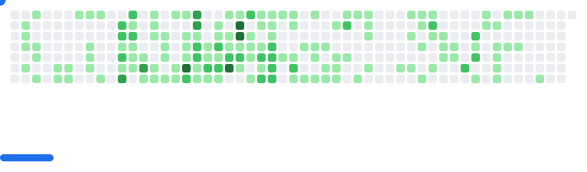

<!-- Banner -->

# 👋 Hi, I’m Akash Ahmed

💼 **Executive – Product & Support @ [Learn with Sumit (LWS)](https://learnwithsumit.com/)** (2021 – Present)  
🚀 Passionate about **Web Development, Product Growth & Developer Experience** 
🌱 Exploring **MERN Stack, DevOps, and Scalable Web Apps** 
✨ Believer in **Clean Code, Problem Solving, and Continuous Learning**

## GitHub Breakout

<picture>
  <source
    media="(prefers-color-scheme: dark)"
    srcset="./assets/breakout-dark.svg"
  />
  <source
    media="(prefers-color-scheme: light)"
    srcset="./assets/breakout-light.svg"
  />
  
</picture>

## 💼 Experience

### **Executive – Product & Support @ Learn with Sumit (LWS)**

📍 _2021 – Present_

-   Supporting & managing **LWS premium courses, products, and students community**
-   Collaborating with developers & instructors to **improve course quality and developer experience**
-   Contributed in building **LWS projects & assignments (MERN, React, Next.js, Node.js, MongoDB)**
-   Handling **technical support, bug reports, and learner issues** to enhance product reliability
-   Optimizing processes for **course launches, platform updates, and product documentation**

## 🛠️ Tech Stack & Skills

## 🌱 Currently Learning

-   MERN Stack Advanced Concepts (SSR, API Integrations, Caching)
-   Product Management & Scaling Developer Platforms
-   Web Security, **JWT Authentication**, and Performance Optimization
-   CI/CD & **DevOps basics** for modern deployment

## 📊 GitHub Highlights

<table >
  <tr>
    <td>
      
    </td>
  </tr>
</table>

## 🏆 GitHub Achievements

  

  
  
  

## ☕ Let’s Connect

  
  
  
  

---

## 📧 Business Inquiries

