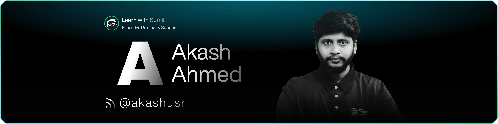
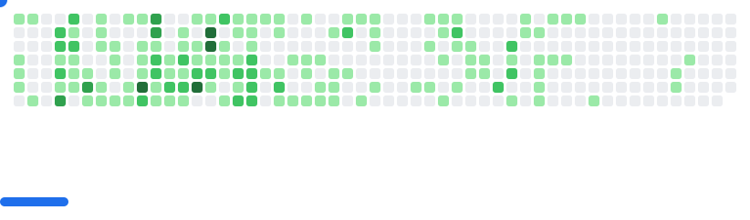

<div align="center">

  

  <h1 align="center">Akash Ahmed</h1>
  
  <p align="center">
    <strong>Product Support Executive • Full-Stack Developer • Developer Experience (DX)</strong>
  </p>

  <p align="center">
    <a href="https://learnwithsumit.com/">
      
    </a>
    <a href="mailto:akashahmed5724@gmail.com">
      
    </a>
    <a href="https://github.com/akashusr">
      
    </a>
    
  </p>

</div>

---

## 👨‍💻 Executive Summary

I operate at the intersection of **Product Engineering, Developer Support, and System Reliability** at [**Learn with Sumit (LWS)**](https://learnwithsumit.com/). My focus revolves around building resilient full-stack applications with the **MERN** ecosystem, streamlining Developer Experience (DX), and building modern workflows utilizing **AI-driven tooling & APIs**.

* 💼 **Current Role:** Executive — Product & Support at **Learn with Sumit (LWS)** *(2021 – Present)*.
* ⚡ **Core Philosophy:** *"Code isn't just about syntax; it's about eliminating user friction, reducing cognitive load, and creating seamless developer workflows."*
* 🤖 **AI-Augmented Engineering:** Integrating LLM tool-calling, Prompt Engineering, and AI APIs (Claude, OpenAI Codex/GPT, Gemini) to build intelligent automation pipelines.
* 🎯 **Continuous Learning:** System Architecture, Distributed Systems, Microservices, and Edge Deployments.

---

## 🛠 Tech Stack at a Glance

All icons powered directly by **[skillicons.dev](https://skillicons.dev/)**:

| Domain | Stack & Technologies |
| :--- | :--- |
| **Frontend Architecture** | <a href="https://skillicons.dev"></a> |
| **Backend & Databases** | <a href="https://skillicons.dev"></a> |
| **AI, Python & Cloud** | <a href="https://skillicons.dev"></a> |
| **Dev Tools & Workflow** | <a href="https://skillicons.dev"></a> |

> 🧠 **AI & LLM Toolchain:** Claude 3.5 Sonnet, OpenAI Codex / GPT-4o, Google Gemini Pro, Cursor AI, GitHub Copilot, and LangChain ecosystem.

---

## 💻 Technical Blueprint & Agent Workflow

```typescript
interface EngineerProfile {
  name: "Akash Ahmed";
  organization: "Learn with Sumit (LWS)";
  specialization: "Developer Experience & Full-Stack Systems";
  coreStack: ["TypeScript", "Next.js", "Node.js", "Express", "MongoDB"];
  aiEcosystem: ["OpenAI & Gemini APIs", "Prompt Engineering", "Copilot", "Claude"];
  currentMission: "Building scalable learning products & diagnosing complex developer issues";
}

// Modern AI-Assisted Issue Triage Pipeline
async function resolveDeveloperIssue(ticket: SupportQuery): Promise<Resolution> {
  const context = await fetchLwsKnowledgeBase(ticket.query);
  const aiAugmentedSolution = await generateSmartFix({ ticket, context });

  return deployFixAndNotify({
    author: "Akash Ahmed",
    status: "Resolved",
    dxImpact: "High"
  });
}
```

---

## 🚀 Featured Experience & Impact

### 🎓 Learn with Sumit (LWS) — Educational Platform & Ecosystem
> Empowering **thousands of developers and tech students** with scalable tech education, robust platform features, and rapid technical resolution.

**🔧 Key Impact & Responsibilities:**
- **Product & Technical Support:** Diagnosing, debugging, and resolving real-time architectural, state management, and API issues for thousands of active developers.
- **Developer Experience (DX):** Streamlining curriculum pipelines, learning tracks, and technical feedback loops to minimize learner churn.
- **Full-Stack Engineering:** Contributing to platform enhancements using **Next.js, Node.js, and MongoDB** for performance and minimal latency.
- **AI Automation:** Applying smart query classification and prompt pipelines to automate frequent developer questions.

---

## 📊 GitHub Analytics & Activity

<div align="center">

  

</div>

---

## 🎮 Take a Break

<div align="center">

<picture>
  <source media="(prefers-color-scheme: dark)" srcset="./assets/breakout-dark.svg" />
  <source media="(prefers-color-scheme: light)" srcset="./assets/breakout-light.svg" />
  
</picture>

</div>

---

## 📫 Let's Connect

<div align="center">

  <a href="https://www.linkedin.com/in/akashusr/" target="_blank">
    
  </a>
  <a href="https://discord.com/users/akashusr/" target="_blank">
    
  </a>
  <a href="https://twitter.com/akashusr" target="_blank">
    
  </a>
  <a href="https://www.instagram.com/akashusr/" target="_blank">
    
  </a>
  <a href="mailto:akashahmed5724@gmail.com">
    
  </a>

</div>

---

<div align="center">

### ✨ Build. Learn. Automate. Repeat.

</div>
